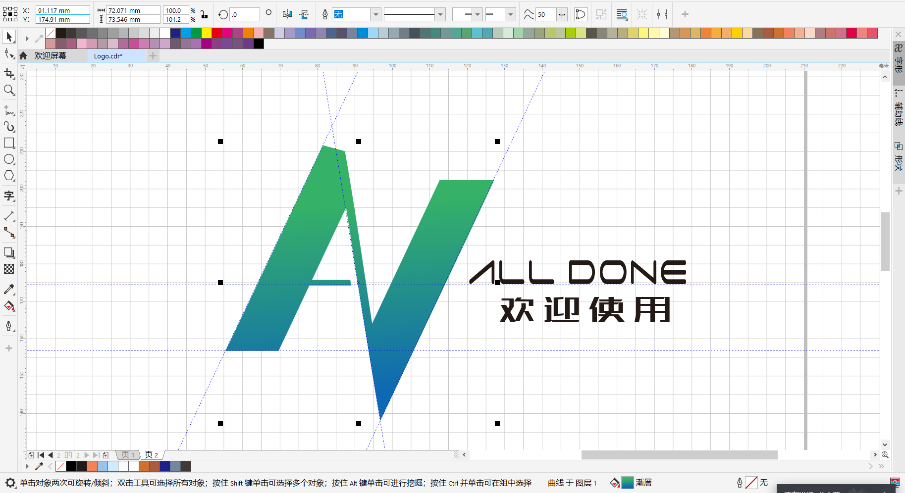
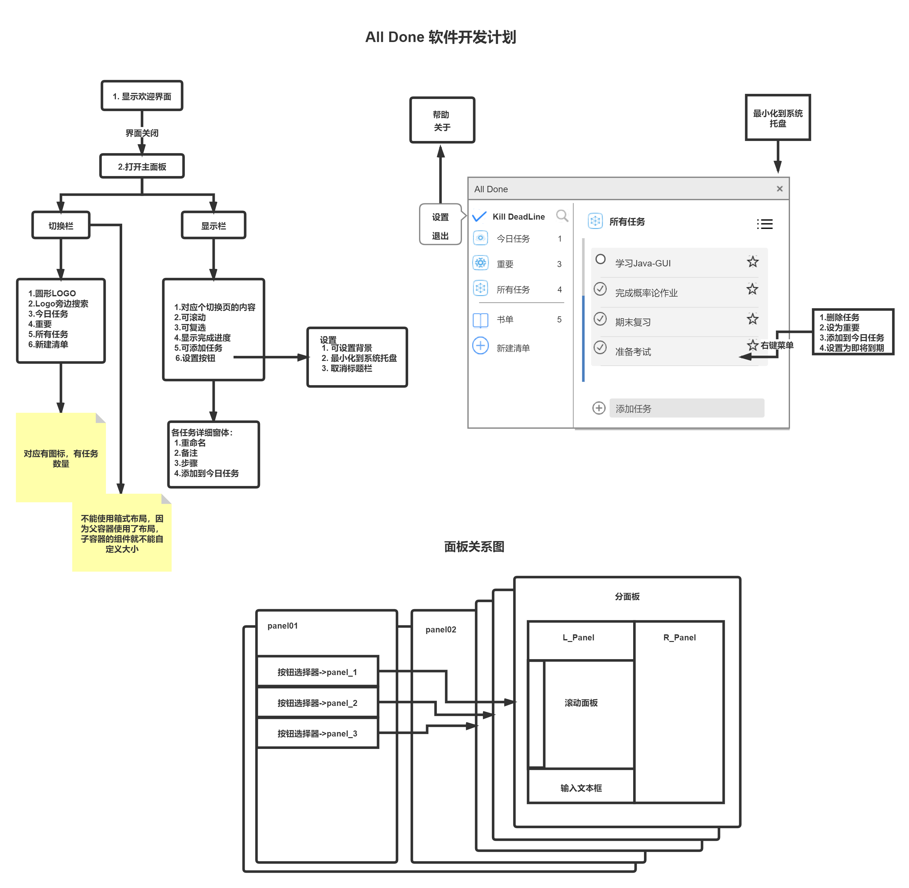
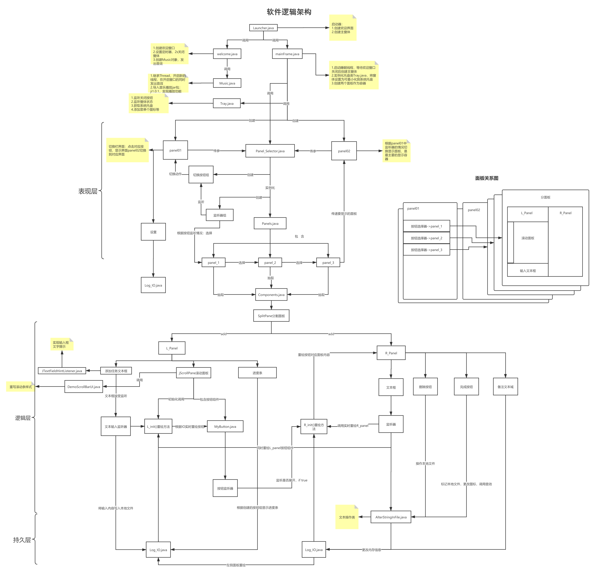
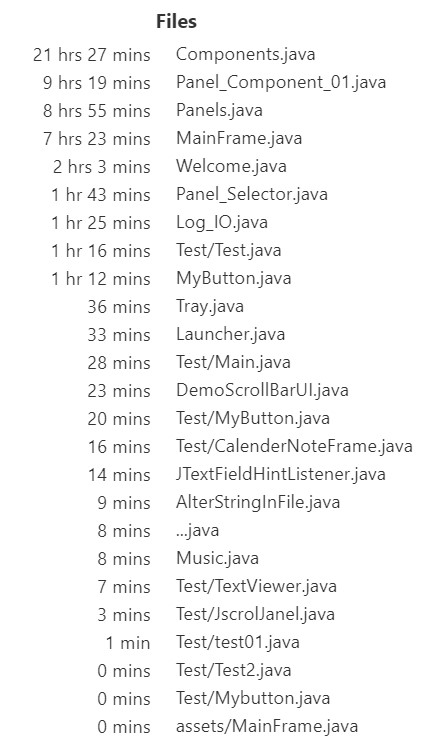
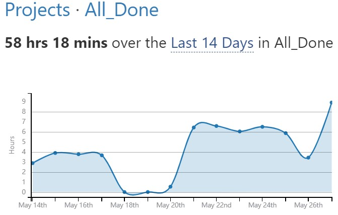

# ALL_DONE

This is a To-do list program written in Java. It references Microsoft's TO-DO.

项目开源地址：https://github.com/chuiyukong/ALL_DONE.git

**用法：**

​		使用IDEA导入项目后，使用`jdk1.8 ` 及以上编译器，执行`Launcher.java`。关于打包成jar包和`.exe`文件 ，经过一番尝试后，由于源码中对于资源文件的依赖，使得打包后程序执行找不到对应目录，需要将源码所有的文件导入方式进行更改。

**演示：**

**LOGO设计：**

**软件开发计划：**

**软件逻辑架构：**

**源程序列表及开发用时：**

总用时：